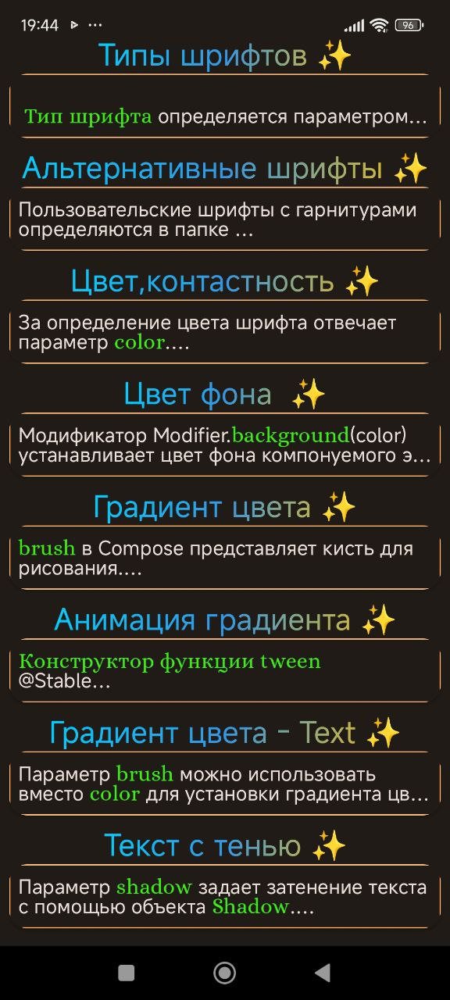

<h1 align="center">
   Android Studio + Kotlin + Compose + Samples
</h1>

    

<h1 align="center">
   Text in jetpack Compose
</h1>

 Простой проект с использованием <b>MVVM</b> архитектуры для реализации приложения под <b>Андроид</b> на языке программирования <b>Котлин</b>.
 
 Содержит примеры отображения текстовой информации с использованием <b>jetpack Compose</b>.

 <b>MVVM (Model-View-ViewModel)</b> — способ организации кода. Помогает отделить пользовательский интерфейс(UI) от данных.

 
<h2 align="center">
   Структура приложения
</h2>

Приложение включает в себя:
  * Screen "<b>Greetings</b>" - экран приветствия
  * Screen "<b>Home</b>" - список названий примеров

Каждый пример содержит:
  * Screen "<b>Result</b>"
  * Screen "<b>Code</b>"
  * Screen "<b>Theory</b>"

<h2 align="center">
   Screen "Greetings"
</h2>

    

   **************************************************

<h2 align="center">
   Screen "Home"
</h2>

<table>
  <tr>
    <td>Home</td>
    <td>continuation</td>
    <td>to be continued</td>
  </tr>
  <tr>
    <td></td>
    <td></td>
    <td></td>
  </tr>
 </table>

   **************************************************

<h2 align="center">
   Пример: "Цвет фона"
</h2>

## Screen "Result" 
<table>
  <tr>
    <td>Preview</td>
    <td>Color selection</td>
  </tr>
  <tr>
    <td></td>
    <td></td>
  </tr>
 </table>

## Screen "Code" 
<table>
  <tr>
    <td>Preview</td>
    <td>to be continued</td>
  </tr>
  <tr>
    <td></td>
    <td></td>
  </tr>
 </table>

   **************************************************

## Screen "Theory" 
<table>
  <tr>
    <td>Preview</td>
    <td>to be continued</td>
  </tr>
  <tr>
    <td></td>
    <td></td>
  </tr>
 </table>

   **************************************************

 

### Пример : "Градиет цвета - Text" (expanded) 
    

   
   
   

    

 
