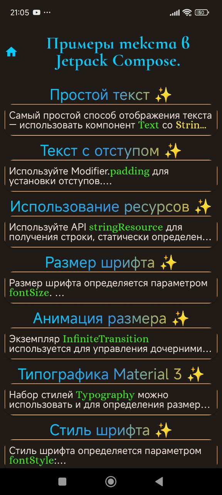

# Android Studio + Kotlin + Compose + Samples

## "Text in jetpack Compose"

Простой проект с использованием MVVM - архитектуры c примерами отображения текстовой информации в Андроид с использованием jetpack Compose

MVVM (Model-View-ViewModel) — способ организации кода.
 Помогает отделить пользовательский интерфейс(UI) от данных.

## Demo

<table>
  <tr>
    <td>Home 1</td>
    <td>Home 2</td>
    <td>Home 3</td>
  </tr>
  <tr>
    <td></td>
    <td></td>
    <td></td>
  </tr>
 </table>

 
