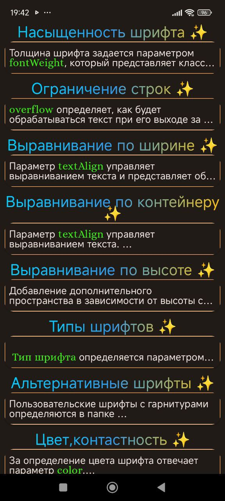
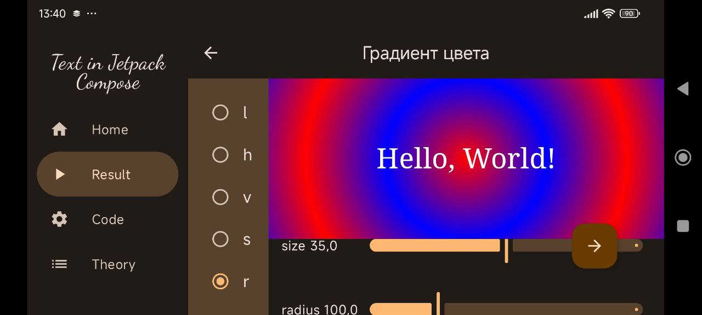

<h1 align="center">
   Android Studio + Kotlin + Compose + Samples
</h1>

    

<h2 align="center">
   Text in jetpack Compose
</h2>

 Простой проект с использованием <b>MVVM</b> архитектуры для реализации приложения под <b>Андроид</b> на языке программирования <b>Котлин</b>.
 
 Содержит примеры отображения текстовой информации с использованием <b>jetpack Compose</b>.

 <b>MVVM (Model-View-ViewModel)</b> — способ организации кода. Помогает отделить пользовательский интерфейс(UI) от данных.

 ## Структура приложения

Приложение содержит:
  * Screen "Greetings" - экран приветствия
  * Screen "Home" - список названий примеров

Каждый пример содержит:
  * Screen "Result"
  * Screen "Code"
  * Screen "Theory"

## Screen "Greetings"
<h2 align="center">
   Screen "Greetings"
</h2>

    

## Demo

<table>
  <tr>
    <td>Home 1</td>
    <td>Home 2</td>
    <td>Home 3</td>
  </tr>
  <tr>
    <td></td>
    <td></td>
    <td></td>
  </tr>
 </table>

Пример: Цвет фона
<table>
  <tr>
    <td>Result 1</td>
    <td>Result 2</td>
  </tr>
  <tr>
    <td></td>
    <td></td>
  </tr>
 </table>

Пример : "Градиет цвета - Text" (expanded) 
<table>
  <tr>
    <td>Result</td>
    <td>Code</td>
    <td>Theory</td>
    <td>Theory small</td>
  </tr>
  <tr>
    <td></td>
    <td></td>
    <td></td>
    <td></td>
  </tr>
 </table>

 
