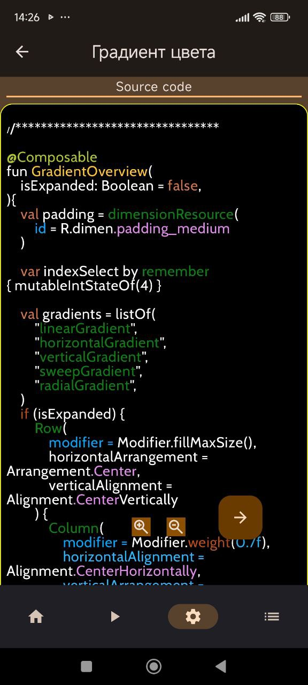

<h1 align="center">
   Android Studio + Kotlin + Compose + Samples
</h1>

    

<h1 align="center">
   Text in jetpack Compose
</h1>

 Простой проект с использованием <b>MVVM</b> архитектуры для реализации приложения под <b>Андроид</b> на языке программирования <b>Котлин</b>.
 
 Содержит примеры отображения текстовой информации с использованием <b>jetpack Compose</b>.

 <b>MVVM (Model-View-ViewModel)</b> — способ организации кода.   
 Помогает отделить пользовательский интерфейс (<b>UI</b>) от данных.   
 <b>UI</b> не зависит от источника данных.  

Подробнее на [Medium...](https://medium.com/@sks727633/mvvm-with-jetpack-compose-structuring-your-app-for-clean-architecture-42f4bad4c99e)

    

<b>Model</b> - представляет данные приложения; 
<b>View</b> - отображает <b>UI</b> и отслеживает его изменения;  
<b>ViewModel</b> - обеспечивает связь между данными и <b>UI</b>, управляет состоянием и бизнес-логикой. 

<h2 align="center">
   Структура приложения
</h2>

Приложение включает в себя:
  * Screen "<b>Greetings</b>" - экран приветствия
  * Screen "<b>Home</b>" - список названий примеров

Каждый пример содержит:
  * Screen "<b>Result</b>"
  * Screen "<b>Code</b>"
  * Screen "<b>Theory</b>"

<h2 align="center">
   Screen "Greetings"
</h2>

    

   **************************************************

<h2 align="center">
   Screen "Home"
</h2>

<table align="center">
  <tr>
    <td>Home</td>
    <td>to be continued</td>
  </tr>
  <tr>
    <td> </td>
    <td> </td>
  </tr>
 </table>

   **************************************************

<h2 align="center">
 "Градиет цвета" 
</h2>

## Screen "Result" 
<table align="center">
  <tr>
    <td>Preview</td>
    <td>more... </td>
  </tr>
  <tr>
    <td></td>
    <td></td>
  </tr>
  <tr>
    <td></td>
    <td></td>
  </tr>
 </table>

## Screen "Code" 
<table align="center">
  <tr>
    <td>Preview</td>
    <td>to be continued</td>
  </tr>
  <tr>
    <td></td>
    <td></td>
  </tr>
 </table>

   **************************************************

## Screen "Theory" 
<table align="center">
  <tr>
    <td>Preview</td>
    <td>to be continued</td>
  </tr>
  <tr>
    <td></td>
    <td></td>
  </tr>
 </table>

   **************************************************

 

###  "Градиет цвета " (expanded) 
    

   
   

   **************************************************

   

   **************************************************

   

   **************************************************
   Двойной клик отображает выбранный раздел во весь экран
   
   

   **************************************************
   
   

   **************************************************

   Клавишей "<b>+</b>" можно увеличить размер шрифта для более комфортного просмотра 
   

   **************************************************
   Клавишей "<b>-</b>" можно меньшить размер шрифта для более комфортного просмотра 
   
   

   **************************************************
   

<h2 align="center">
   "Цвет фона"
</h2>

## Screen "Result" 
<table align="center">
  <tr>
    <td>Preview</td>
    <td>Color selection</td>
  </tr>
  <tr>
    <td></td>
    <td></td>
  </tr>
 </table>

 <h2 align="center">
   Примеры с анимацией
</h2>

## Screen "Result" 
<table align="center">
  <tr>
    <td>Preview</td>
    <td>more...</td>
  </tr>
  <tr>
    <td></td>
    <td></td>
  </tr>
 </table>

   **************************************************
   
   
   
   **************************************************

<h2 align="center">
   Другие примеры...
</h2>

## Screen "Result" 
<table align="center">
  <tr>
    <td>Preview</td>
    <td>more... </td>
  </tr>
  <tr>
    <td></td>
    <td></td>
  </tr>
  <tr>
    <td></td>
    <td></td>
  </tr>
  <tr>
    <td></td>
    <td></td>
  </tr>
 </table>

    

 
